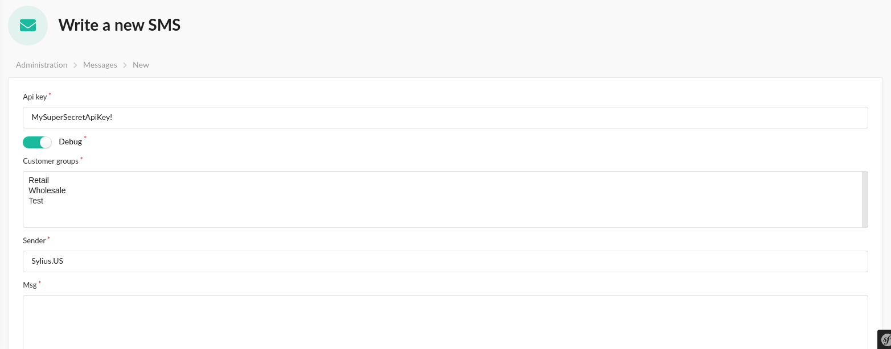
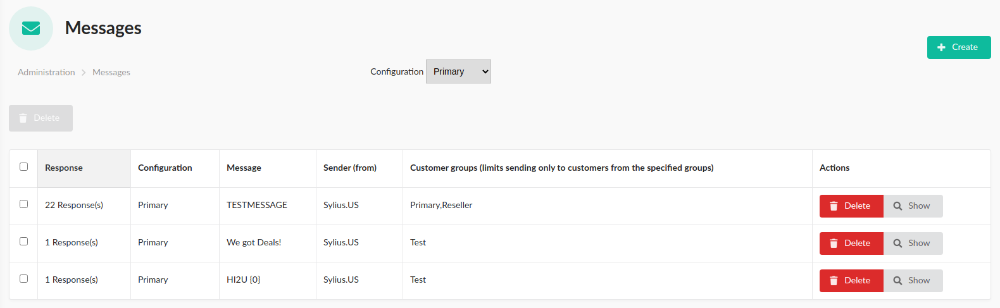
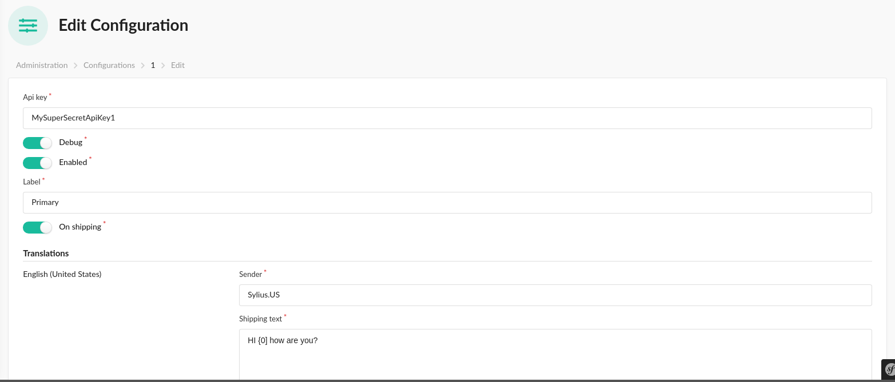
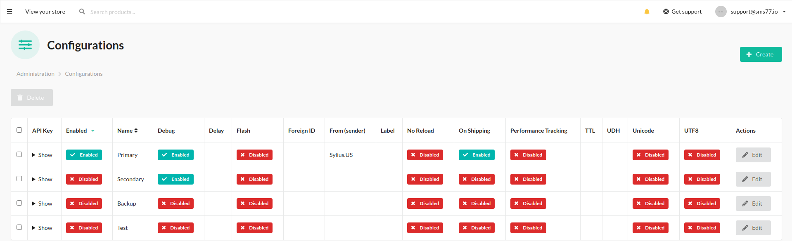

# Official Sylius Plugin for Sms77.io
Programmatically send SMS by subscribing to Sylius events.<br>
Send out Bulk SMS to all of your customers at once.<br>
Make it even easier for your customers to get informed about order updates and shop related information.

## Installation

1. Require the package via composer
    ```composer require sms77/sylius-plugin```

2. Add to config/bundles.php
    ```Sms77\SyliusPlugin\Sms77SyliusPlugin::class => ['all' => true],```

3. Add to config/routes.yaml
    ```yaml
    sms77_sylius_plugin:
        resource: "@Sms77SyliusPlugin/Resources/config/admin_routing.yml"
    ```

4. Add to config/services.yaml
    ```yaml
    imports:
        - { resource: "@Sms77SyliusPlugin/Resources/config/config.yml" }
    ```

5. Make migrations
    ```php bin/console doctrine:migrations:diff```
    ```php bin/console doctrine:migrations:execute --up XXXXXXXXXXXX```
     
6. Navigate to Sms77->Configurations and create your first configuration.

### Screenshots




