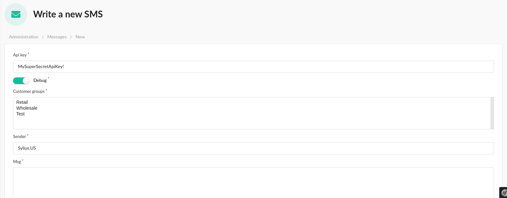
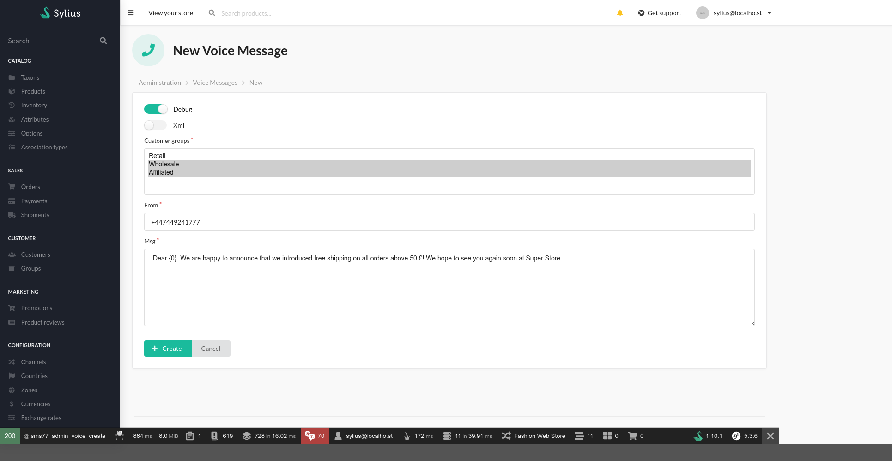
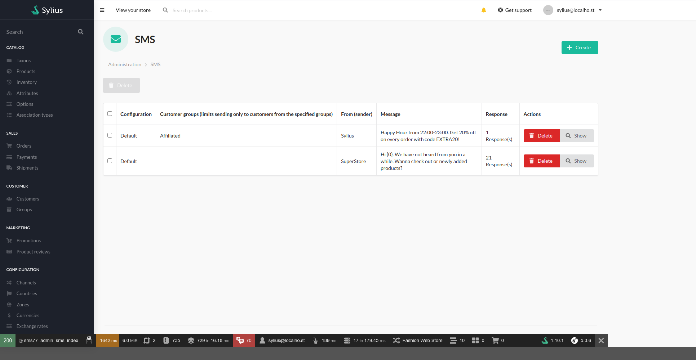
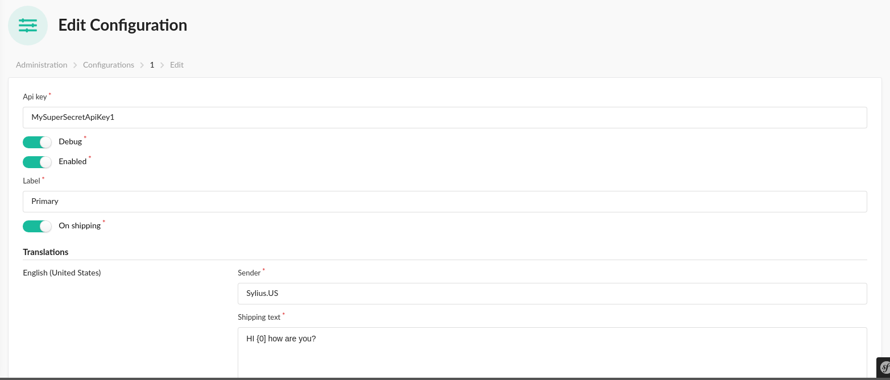
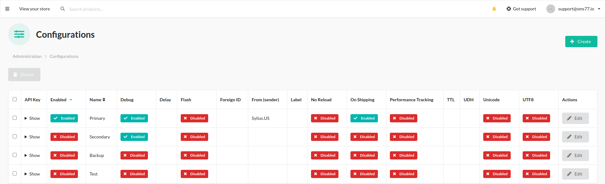

<p align="center">
  
</p>

<h1 align="center">seven SMS for Sylius</h1>

<p align="center">
  Send SMS and text-to-speech calls from <a href="https://sylius.com/">Sylius</a> - manually, in bulk, or programmatically via Sylius events.
</p>

<p align="center">
  <a href="LICENSE"></a>
  
  
  <a href="https://packagist.org/packages/seven.io/sylius"></a>
</p>

---

## Features

- **SMS & Voice** - Send single or bulk SMS plus text-to-speech calls from the Sylius admin
- **Event-Driven** - Subscribe to Sylius events (order placed, shipped, etc.) to fire SMS automatically
- **Bulk Customer Messaging** - Reach all customers at once with one click
- **Order-Update Notifications** - Pre-built flows for keeping customers informed about order status

## Prerequisites

- Sylius 1.x
- PHP 8.2+
- A [seven account](https://www.seven.io/) with API key ([How to get your API key](https://help.seven.io/en/developer/where-do-i-find-my-api-key))

## Installation

### 1. Install via Composer

```bash
composer require seven.io/sylius
```

### 2. Register the bundle

Add to `config/bundles.php`:

```php
Seven\SyliusPlugin\SevenSyliusPlugin::class => ['all' => true],
```

### 3. Wire admin routing

Add to `config/routes.yaml`:

```yaml
seven_sylius_plugin:
    resource: "@SevenSyliusPlugin/Resources/config/admin_routing.yml"
```

### 4. Import services

Add to `config/services.yaml`:

```yaml
imports:
    - { resource: "@SevenSyliusPlugin/Resources/config/config.yml" }
```

### 5. Run migrations

```bash
php bin/console doctrine:migrations:diff
php bin/console doctrine:migrations:migrate
```

### 6. Configure

Open **Seven > Configurations** in the Sylius admin and create your first configuration with your seven API key.

## Screenshots

| | |
|---|---|
|  |  |
|  |  |
|  |  |

## Support

Need help? Feel free to [contact us](https://www.seven.io/en/company/contact/) or [open an issue](https://github.com/seven-io/sylius/issues).

## License

[MIT](LICENSE)
