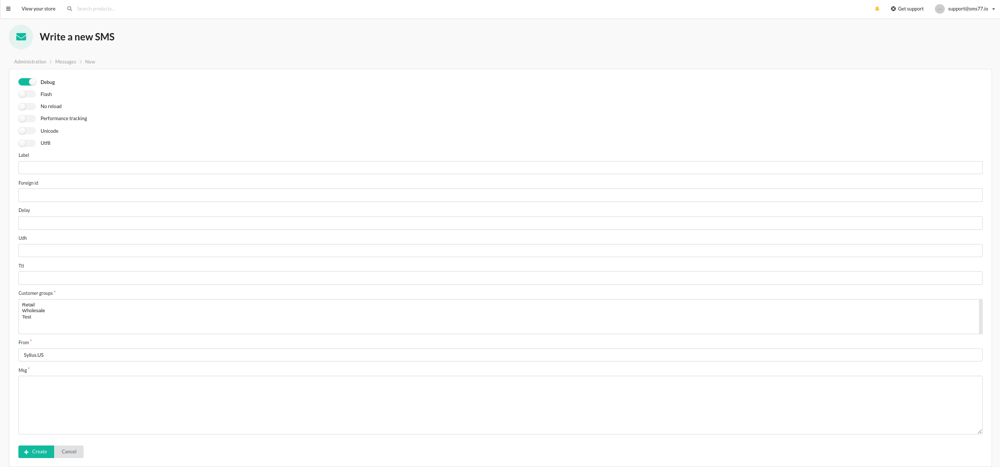

# Official Sylius Plugin for seven.io
Supports sending SMS and making text-to-speech calls.
Programmatically send messages by subscribing to Sylius events.<br>
Send out bulk messages to all of your customers at once.<br>
Make it even easier for your customers to get informed about order updates and shop related information.

## Installation

1. Require the package via composer
    ```composer require seven.io/sylius```

2. Add to config/bundles.php
    ```Seven\SyliusPlugin\SevenSyliusPlugin::class => ['all' => true],```

3. Add to config/routes.yaml
    ```yaml
    seven_sylius_plugin:
        resource: "@SevenSyliusPlugin/Resources/config/admin_routing.yml"
    ```

4. Add to config/services.yaml
    ```yaml
    imports:
        - { resource: "@SevenSyliusPlugin/Resources/config/config.yml" }
    ```

5. Make and execute migrations
    ```php bin/console doctrine:migrations:diff```
    ```php bin/console doctrine:migrations:migrate```
     
6. Navigate to Seven->Configurations and create your first configuration.

### Screenshots



### Support

Need help? Feel free to [contact us](https://www.seven.io/en/company/contact/).

[](LICENSE)
